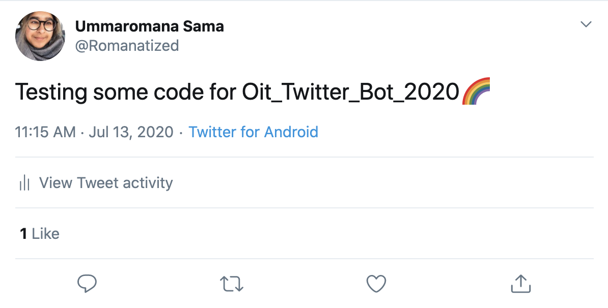
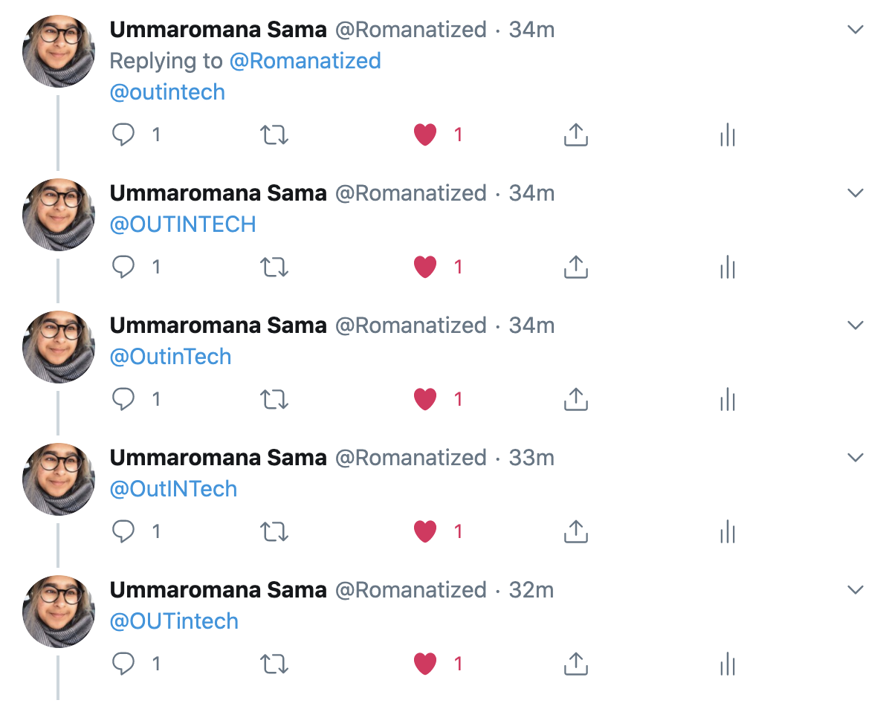
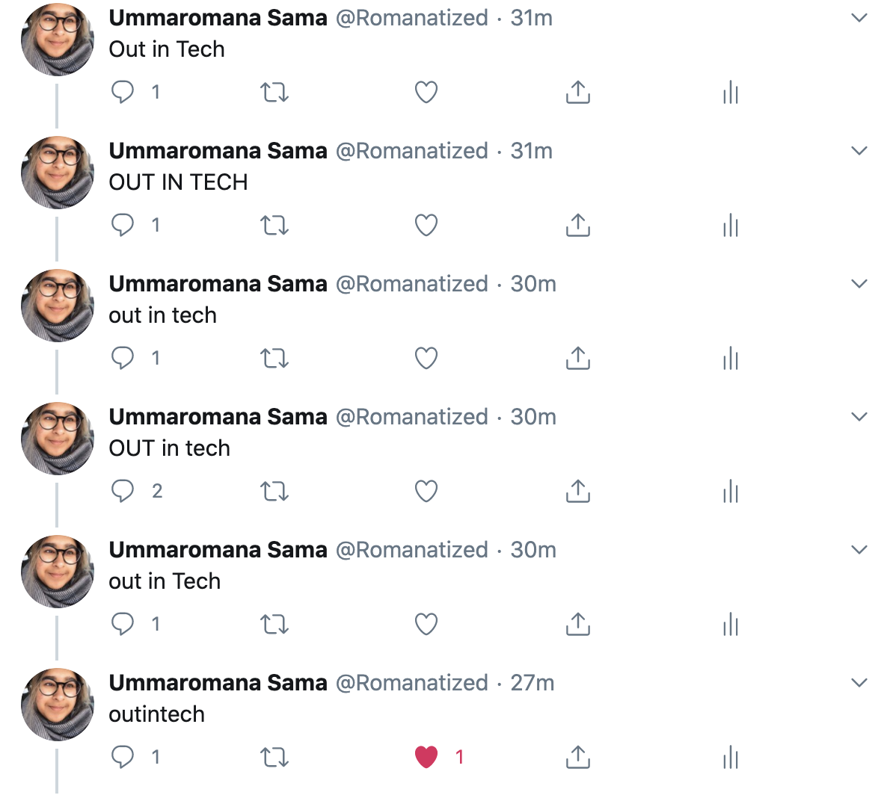
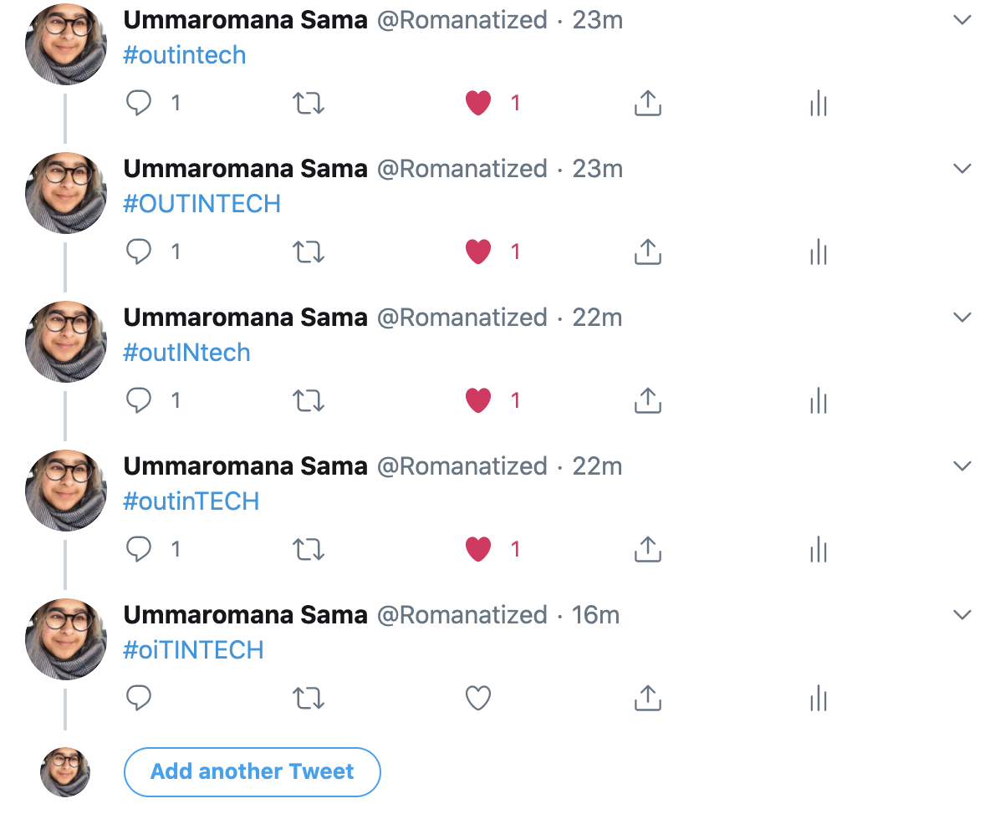

# OiT_Twitter_Bot_2020

Overview: In Summer 2020, I had the opportunity to intern with Out in Tech as their Programs and Communications Intern. My primary objective was to brainstorm and execute strategies to grow the Out in Tech community. The OiT_Twitter_Bot_2020 is a Twitter bot that favorites tweets involving the phrase "outintech". Ideally, this would be associated in the Out in Tech Twitter account and deployed onto Heroku. Tweets related to Out in Tech would be supported, a ripple effect across Twitter's platform will be created, and additional exposure would be curated.

Follow Out in tech on Twitter: https://twitter.com/OutInTech

For more information about Out in Tech: https://outintech.com/

Upon testing out my code, I tried to like tweets with different variations of the phrase "outintech" to find the intersection of efficiency and effectiveness.

